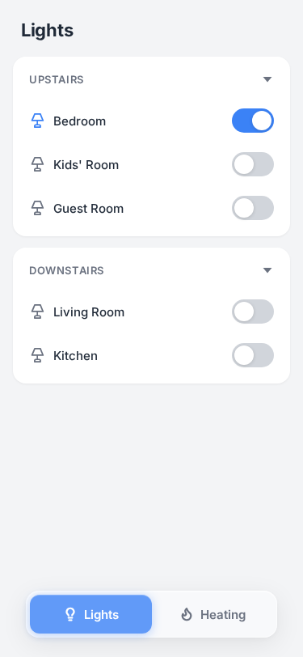
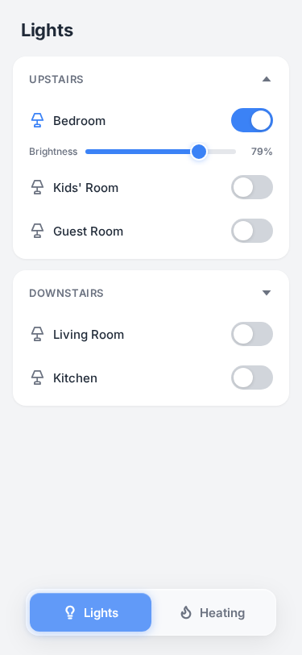
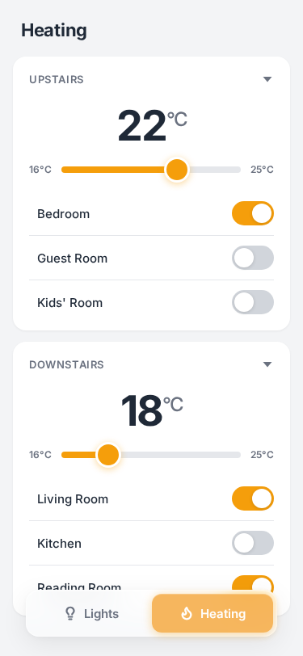
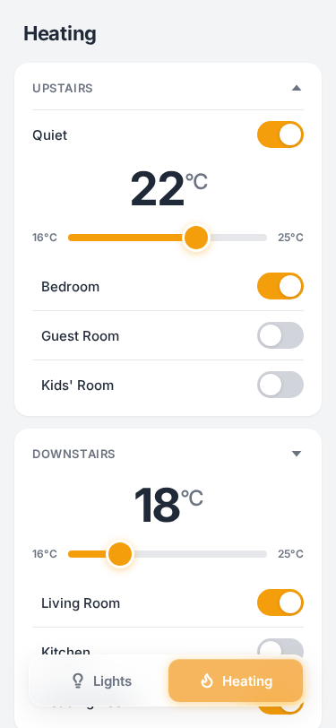

# Home Control — User Manual

Welcome! This guide explains how to use the Home Control app to manage the lights and heating in the house.

## Opening the App

Open your phone's web browser and go to:

<a href="{{BASE_URL}}" class="app-url">{{BASE_URL}}</a>

You can also add it to your home screen for quick access — it works just like a regular app.

## Overview

The app has two main sections:

- **Lights** — Turn lights on and off, and adjust brightness
- **Heating** — Set room temperatures and control heating units

You switch between these using the buttons at the bottom of the screen.

## The Tab Bar

At the bottom of the screen, you'll see two buttons:

- **Lights** (lightbulb icon) — Tap to see and control all lights
- **Heating** (flame icon) — Tap to see and control heating

The currently selected tab is highlighted in blue (for lights) or orange (for heating).

---

## Lights

The Lights tab shows all the lights in the house, organized by area (like "Upstairs" and "Downstairs").

### Turning Lights On and Off

Each light has a toggle switch next to its name:

- **Slide right** (or tap) to turn the light **on** — the switch turns blue
- **Slide left** (or tap) to turn the light **off** — the switch turns grey

The lamp icon next to each light also changes — it turns blue when the light is on.

### Adjusting Brightness

Some lights support brightness control. To access brightness settings:

1. Tap the **small arrow** (▼) in the top-right corner of an area card
2. This reveals brightness sliders below each light that supports it
3. Drag the slider left or right to adjust brightness
4. The percentage shows the current brightness level

> **Tip:** When a light is off, the brightness slider appears greyed out. You can still adjust it — when you turn the light back on, it will remember your setting.

---

## Heating

The Heating tab shows temperature controls and heating units for each area.

### Understanding the Display

Each area shows:

- **Temperature** — A large number showing the current target temperature
- **Temperature slider** — Drag to set the temperature (16°C to 25°C)
- **Room toggles** — Individual switches for each heating unit

### Setting the Temperature

Drag the temperature slider left or right to change the target temperature for that area. The large number updates as you drag.

This sets the temperature for all heating units in that area.

### Turning Rooms On and Off

Each room has its own toggle switch:

- **On** (orange switch) — The heating unit is active and will heat to the target temperature
- **Off** (grey switch) — The heating unit is turned off

You can turn individual rooms on or off without affecting other rooms in the same area.

### Quiet Mode

Heating units have a "Quiet Mode" that runs the system more quietly (useful at night).

To access Quiet Mode:

1. Tap the **small arrow** (▼) in the top-right corner of an area card
2. This reveals the **Quiet** toggle
3. Turn it on to enable quiet mode for all units in that area

---

## Tips

- **Changes take effect immediately** — When you flip a switch or drag a slider, the change is sent right away
- **Works on any device** — You can use this on your phone, tablet, or computer
- **Add to home screen** — For the best experience on mobile, add the app to your home screen. On iPhone, tap the share button and choose "Add to Home Screen"
- **Offline notice** — If the connection is lost, a loading spinner will appear. The page will automatically reconnect when the server is available again

## Troubleshooting

**The page shows a loading spinner:**

This means the app has lost connection to the server. It will try to reconnect automatically. If it doesn't recover, try refreshing the page.

**A light or heating unit isn't responding:**

The physical device might be temporarily unavailable (e.g., turned off at the wall, or out of wireless range). Try again in a moment, or check that the device has power.

**The app looks different on desktop:**

On larger screens, the app shows lights and heating side by side instead of using tabs. The controls work the same way.
